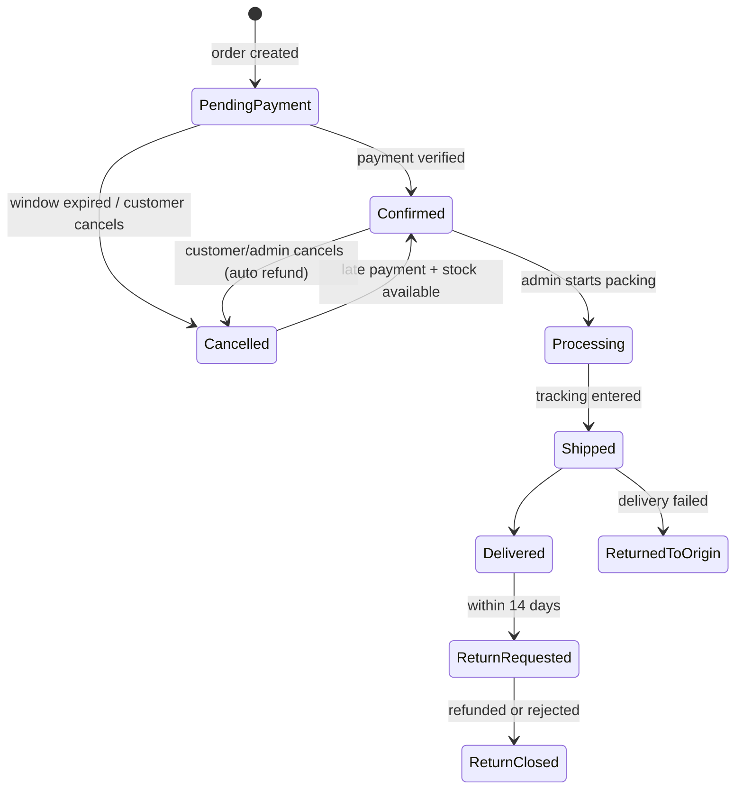

# Korner — Product Specification

> Source of truth for **what** Korner does. Technical **how** lives in `02-TECHNICAL_DESIGN.md`,
> look & feel in `03-DESIGN_SYSTEM.md`, build order in `04-IMPLEMENTATION_PLAN.md`.
> Every requirement has a stable ID (e.g. `CHK-04`). Reference IDs in commits, PRs and tests.

**Phases:** `MVP` = must exist on launch day · `P2` = first update after launch · `P3` = later, when numbers justify it.
Only build `MVP` items unless a task in the implementation plan says otherwise.

---

## 1. Overview & scope

Korner is an Egyptian B2C online store selling items with size/colour/volume variants (T-shirts, shoes, perfumes).
Arabic + English from day one (Arabic default, RTL). Mobile first. Online payment only (card + mobile wallet via Paymob).
Google sign-in plus email/password. Guest checkout allowed.

**MVP goal:** a customer finds a product, picks a size, pays online, and tracks the order. The admin runs products,
stock, orders, shipping prices and refunds without touching code.

**In scope (MVP):**

- Catalogue with variants (size × colour), stock per variant, own-stock items and dropship (supplier) items
- Server-side cart, guest or signed-in checkout, online payment via Paymob (card + wallet)
- Order tracking, returns (refund only), admin panel
- Arabic + English, EGP only, delivery inside Egypt only (all 27 governorates, shipped manually)

**Out of scope (MVP):** cash on delivery, shipping-company API integrations, mobile app, marketplace sellers,
international shipping, other currencies, subscriptions, loyalty points, coupons (P2), reviews (P2), Google Maps.

---

## 2. Decisions log (fixed — do not change without the owner)

| # | Topic | Decision |
| --- | --- | --- |
| D1 | Build | Custom code. Owner develops with Claude Code. Security-critical parts (auth, payments) use proven libraries |
| D2 | Backend | ASP.NET Core 9 Web API, Controller → Service → EF Core, `Result`/`Error` pattern (see technical design §3) |
| D3 | Database | SQL Server + EF Core 9 (migrations) |
| D4 | Frontend | React Router 7 **framework mode**, SSR for public pages, TypeScript strict |
| D5 | Languages | Arabic (default, `/`) + English (`/en/`). A product cannot be published unless both languages are complete |
| D6 | Payments | **Online only.** Paymob Intention API + Unified Checkout (hosted page). Card (Visa/Mastercard/Meeza) + mobile wallets. Code sits behind `IPaymentProvider` |
| D7 | Cash on delivery | **Not offered.** Not in MVP; may be reconsidered in the future |
| D8 | Shipping | **No shipping-company integration.** Each governorate has a manual rule (fee, delivery days, active). The owner ships with his own courier or any carrier he picks, and types the tracking number/link in the admin panel |
| D9 | Returns | 14 days from delivery. Customer pays return shipping unless the item is defective or the store made a mistake. Opened perfume is not returnable unless defective. MVP = refund only (no exchange flow) |
| D10 | Product sourcing | Both own stock (`InStock`, stock is decremented) and supplier items (`Dropship`, no stock count, extra lead time) |
| D11 | Money | Every amount is an integer number of **piasters** (`bigint`/`long`), currency EGP only. Never `decimal`/`float` for money |
| D12 | Brand | Name **Korner**. Colours: tweakcn "Twitter" theme with contrast fixes. Fonts: Open Sans (Latin) + Noto Sans Arabic. Logo: to be provided — use a text wordmark until then |
| D13 | Hosting | Decided later (task M7). Must run Docker + SQL Server, have daily backups and public HTTPS (Paymob webhooks need it) |
| D14 | Maps | No Google Maps in MVP. Address = governorate + area + street/building + landmark |
| D15 | Repository | Monorepo `https://github.com/Ahmedsayed732004444/Korner.git` → `backend/` + `frontend/` + `docs/` |
| D16 | Images | Stored on the API server (`wwwroot/uploads`, Docker volume, backed up), processed locally to WebP — no cloud image service |
| D17 | Background jobs & caching | Hangfire (separate `KornerJobs` DB) and HybridCache, following the owner's recipes repo `https://github.com/Ahmedsayed732004444/dotnet-recipes` |
| D18 | Email | Gmail SMTP during development/MVP testing; a domain mailbox with SPF/DKIM/DMARC before launch |

---

## 3. Roles & permissions

Every permission is enforced on the server, never only in the UI.

| Permission | Guest | Customer | Staff (P2) | Admin |
| --- | --- | --- | --- | --- |
| Browse, cart, checkout | ✓ | ✓ | ✓ | ✓ |
| Track an order by number + phone | ✓ | ✓ | ✓ | ✓ |
| Account: orders, addresses | — | ✓ | — | — |
| Process & ship orders, adjust stock | — | — | ✓ | ✓ |
| Products, prices, content, settings | — | — | — | ✓ |
| Refunds | — | — | — | ✓ |
| Reports | — | — | — | ✓ |

- **ACC-R1 (MVP):** every sensitive action (price change, order cancel, refund, manual stock change, settings change) is written to `AuditLogs` with actor, time, before/after values.
- **ACC-R2 (MVP):** Admin accounts require TOTP two-factor authentication; it cannot be disabled from the UI.
- **ACC-R3 (MVP):** roles (and later permissions) are claims inside the JWT; `[Authorize(Roles = "Admin")]` must work from the token.

---

## 4. Catalogue, product page, search

A customer reaches any product in ≤ 3 taps from home.

| ID | Requirement | Phase | Acceptance criteria |
| --- | --- | --- | --- |
| CAT-01 | Two-level categories (e.g. Men → T-shirts), name + slug per language | MVP | Both `/category/{slugAr}` and `/en/category/{slugEn}` work |
| CAT-02 | Products have variants (size × colour); each variant has SKU, price, compare-at price, stock, fulfilment type (`InStock`/`Dropship`), lead time | MVP | A product with zero variants cannot be published |
| CAT-03 | Name, description, slug in both languages; publishing blocked if any is missing | MVP | "Publish" disabled with a written reason |
| CAT-04 | Multiple 3:4 images with zoom; images can be tied to a colour | MVP | Selecting a colour switches the gallery |
| CAT-05 | Out-of-stock sizes stay visible, struck through, labelled "Sold out" | MVP | Stock-0 variant visible and cannot be added |
| CAT-06 | Size guide per brand or product type | MVP | "Size guide" link next to sizes opens the table |
| CAT-07 | Perfume attributes: volume (ml), concentration (EDP/EDT/Parfum), scent family, notes | MVP | Shown only for products of type Perfume |
| CAT-08 | Expected delivery shown on the product page per variant type | MVP | Dropship variants show the longer time before add-to-cart |
| CAT-09 | Trust line under the buy button: secure online payment (card / wallet), 14-day returns, shipping fee | MVP | Visible in the first mobile viewport |
| CAT-10 | Search by name in both languages with Arabic normalisation (أ/إ/آ→ا, ة→ه, ى→ي, remove tatweel & diacritics) | MVP | "تيشيرت", "تى شيرت", "tshirt" return the same core results |
| CAT-11 | Filters: price, size, colour, brand, in-stock only. Sort: newest, price ↑, price ↓, best-selling | MVP | Filters & sort live in the URL |
| CAT-12 | "No results" page with "Clear filters" and suggestions | MVP | Never an empty page |
| CAT-13 | Typo-tolerant search (Meilisearch) | P2 | — |
| CAT-14 | Verified-buyer reviews with admin moderation | P2 | — |
| CAT-15 | Wishlist | P2 | — |
| CAT-16 | Similar products, recently viewed | P2 | — |
| CAT-17 | "Notify me when back in stock" (email) | P3 | — |

---

## 5. Cart & checkout

From product page to "Order placed" in ≤ 4 steps for a guest; checkout form has ≤ 8 fields.
**The server is the only source of any price or total.**

| ID | Requirement | Phase | Acceptance criteria |
| --- | --- | --- | --- |
| CART-01 | Cart stored on the server, identified by a `cart_token` httpOnly cookie; survives browser restarts (30 days) | MVP | Close/reopen browser → same cart |
| CART-02 | On sign-in, the guest cart merges into the account cart | MVP | No item lost or duplicated (quantities summed, capped by stock) |
| CART-03 | Change quantity, remove, with "Undo" after remove | MVP | — |
| CART-04 | "Add X EGP more for free shipping" bar | MVP | Updates on every change |
| CART-05 | If price or stock changed since adding, the customer sees a notice before paying | MVP | No order is ever created at an old price |
| CHK-01 | Guest checkout allowed; Google sign-in offered but optional | MVP | No forced account creation |
| CHK-02 | One checkout page with: full name, mobile, email, governorate, area/city, address (street + building + floor/apt), landmark (optional), payment method (card / wallet) | MVP | ≤ 8 fields |
| CHK-03 | Egyptian mobile: 11 digits, starts with 010/011/012/015 | MVP | Blocked before submit with a message that states the correct format |
| CHK-04 | Totals (items + shipping) calculated by the server (`POST /checkout/quote`) and shown before confirming | MVP | Frontend never computes or sends a price |
| CHK-05 | Shipping fee and expected delivery date come from the governorate + item types | MVP | Changing governorate updates both instantly |
| CHK-07 | Checkbox "I agree to the Terms & Privacy Policy" (required) + separate marketing-consent checkbox, unchecked by default | MVP | — |
| CHK-08 | Confirm button disables after first click; `POST /orders` requires an `Idempotency-Key` | MVP | Double click never creates two orders |
| CHK-09 | If payment fails, the customer returns to the same order and can retry (same or other method) | MVP | No new order, no data lost |
| CHK-10 | "Order placed" page: order number, expected delivery date, next step, link to tracking | MVP | Shown only after payment is confirmed by the server |
| CHK-11 | Coupons | P2 | — |
| CHK-12 | Saved address / last method as defaults for signed-in customers | P2 | — |

---

## 6. Accounts & sign-in

| ID | Requirement | Phase | Acceptance criteria |
| --- | --- | --- | --- |
| ACC-01 | Google sign-in (OAuth) | MVP | One click from the sign-in page and from checkout |
| ACC-02 | Email + password with email confirmation and "Forgot password" | MVP | ≥ 8 characters; email confirmed before first sign-in |
| ACC-03 | Same email via Google and password = one account | MVP | Never two accounts with one email |
| ACC-04 | After a guest purchase, registering with the same email links past orders to the account | MVP | Order appears in "My orders" |
| ACC-05 | My account: orders + status, addresses, preferred language | MVP | — |
| ACC-06 | Request account deletion; account disabled immediately, personal data erased within 30 days, orders kept anonymised | MVP | — |
| ACC-07 | "Buy again" | P2 | — |
| ACC-08 | Download my data | P2 | — |

**Session:** access token lives 15 minutes, **in memory only**. Refresh token lives 15 days in an
`httpOnly; Secure; SameSite=Lax` cookie set by the API, rotated on every use; reuse of an old refresh token revokes
all sessions of that user. **No token in `localStorage` ever.**

---

## 7. Payments (Paymob, online only)

An order is confirmed **only** when the server receives and verifies a Paymob webhook (or an inquiry confirms it).
The customer returning to the "success" URL never confirms anything.

| Method | Phase | Notes |
| --- | --- | --- |
| Card (Visa / Mastercard / Meeza) | MVP | Paymob card integration, 3-D Secure |
| Mobile wallets (Vodafone Cash, etc.) | MVP | Paymob wallet integration |
| Fawry reference code, instalments (valU…) | P3 | — |

**Cost reference:** Paymob public price 2.75% + 3 EGP per transaction, weekly settlement.

| ID | Requirement | Phase | Acceptance criteria |
| --- | --- | --- | --- |
| PAY-01 | Paymob Intention API + Unified Checkout, behind `IPaymentProvider` | MVP | Swapping gateway does not touch order services |
| PAY-02 | Verify **HMAC-SHA512** (20 fields, fixed order, `?hmac=` query param) before any processing; constant-time compare | MVP | Wrong signature → 401, nothing changes |
| PAY-03 | Paid amount must equal order total in piasters exactly, currency EGP, reference matches | MVP | Mismatch → order flagged `RequiresReview`, admin alerted, not confirmed |
| PAY-04 | Duplicate webhooks ignored (unique index on provider transaction id) | MVP | Same webhook twice → one confirmation |
| PAY-05 | Processing is one fast DB transaction; respond 200 after commit, 500 on error so Paymob retries; emails via Outbox | MVP | — |
| PAY-06 | Reconciliation job every 15 min asks Paymob about unfinished attempts from the last 48 h | MVP | A paid order whose webhook was lost is confirmed within 15 min |
| PAY-07 | `PendingPayment` order is cancelled after its 15-minute window and its stock released, but Paymob is asked first. Each new payment attempt restarts a 15-min window; max 5 attempts per order | MVP | No paid order is ever cancelled by mistake |
| PAY-08 | Payment arriving for an already-cancelled order: re-reserve stock → `Confirmed`; if impossible → automatic full refund + email | MVP | No money kept without an order or a refund |
| PAY-09 | Full or partial refund from the admin panel (Admin only), audited, idempotent | MVP | Refunded total never exceeds paid total |
| PAY-10 | Card data never touches Korner servers (hosted Paymob page) | MVP | — |
| PAY-11 | PDF invoice per order (Arabic always present, English per order language) | MVP | Available from "My orders" and admin |

---

## 8. Orders, shipping, returns

### 8.1 Order state machine (the only allowed transitions)

- **`RequiresReview` is a flag, not a state.** Set when payment amount mismatches (PAY-03), when an online order total > 10,000 EGP comes from a first-time customer, or when an automatic refund could not be queued. A flagged order cannot move to `Processing` until an admin clears the flag.
- **Stock:** `InStock` variants are decremented at order creation (reservation). Stock returns automatically on `Cancelled`; on `ReturnedToOrigin` and `ReturnClosed` it returns only after staff inspection (manual action). `Dropship` variants never touch stock.

| ID | Requirement | Phase | Acceptance criteria |
| --- | --- | --- | --- |
| ORD-05 | Customer can cancel while `PendingPayment` or `Confirmed`; after that only via support. Cancelling a paid order queues an automatic full refund | MVP | — |
| ORD-06 | Size/address change before shipping via support (admin edits order, change is logged) | MVP | Every edit is in the order history |
| ORD-07 | Track an order with order number + mobile, no account needed | MVP | Rate-limited |

### 8.2 Shipping (manual, no carrier integration)

| ID | Requirement | Phase | Acceptance criteria |
| --- | --- | --- | --- |
| SHP-01 | Shipping rule per governorate: active, fee, delivery days. Global free-shipping threshold. All editable in admin | MVP | All 27 governorates have a rule before launch; inactive governorates are not selectable at checkout |
| SHP-02 | Expected delivery date = confirmation date + governorate days + max dropship lead time in the order | MVP | Shown to the customer and stored on the order |
| SHP-03 | Admin alert 2 days before the expected date if not shipped, and for any order 30 days old and not delivered | MVP | — |
| SHP-04 | On `Shipped`, admin types courier name (free text), tracking number and optional tracking URL | MVP | Shown on tracking page and in the shipped email |
| SHP-05 | Shipping-company API integration (e.g. Bosta) | P3 | — |

### 8.3 Returns (refund only in MVP)

| ID | Requirement | Phase | Acceptance criteria |
| --- | --- | --- | --- |
| RET-01 | Clear returns policy page + one-line summary on the product page | MVP | — |
| RET-02 | In MVP the customer requests a return via WhatsApp/email; admin records it on the order (reason + photos) → `ReturnRequested` | MVP | Every return has a record |
| RET-03 | Refund to the original payment method within 7 days of receiving the item (Paymob refund, full or partial) | MVP | Admin panel warns when a return is open > 5 days |
| RET-05 | Returned items go back to stock only after staff inspection | MVP | — |
| RET-04 | Size exchange flow | P2 | — |
| RET-06 | Self-service return request from "My orders" | P2 | — |

---

## 9. Notifications (email in MVP)

Email is **required** at checkout (it is the only notification channel). Emails are sent in the order language.

| Event | Channel | Content |
| --- | --- | --- |
| Payment confirmed | Email | Items, total, expected delivery date, tracking link, invoice link |
| Shipped | Email | Courier, tracking number/link |
| Cancelled | Email | Reason, refund timing if paid |
| Refunded | Email | Amount, method, expected bank time (up to 14 days) |
| Late payment refunded (PAY-08) | Email | Apology, refund amount |
| Admin alerts | Email to admin | Amount mismatch, unmatched transaction, unknown refund result, late shipment, low stock, open return > 5 days |

- **NTF-01 (MVP):** emails are written to an `OutboxMessages` table inside the same DB transaction as the business change; a job sends them with retries. Unique `DeduplicationKey` prevents duplicates.
- **NTF-02 (MVP):** templates in Arabic and English; sender display name "Korner". Before launch the sender moves from Gmail to a domain mailbox with SPF, DKIM, DMARC (D18).
- **NTF-03 (P3):** automated WhatsApp messages.
- **NTF-04 (P3):** marketing emails, only to customers who opted in (CHK-07), with unsubscribe link.

---

## 10. Admin panel

Works on desktop **and** mobile.

| ID | Requirement | Phase | Acceptance criteria |
| --- | --- | --- | --- |
| ADM-01 | Products: create/edit in both languages, variant grid (size × colour) with price, stock, SKU, fulfilment type, lead time; drag-and-drop images; Draft / Published / Hidden | MVP | Hidden products disappear from store, search and sitemap |
| ADM-02 | Categories and size guides | MVP | — |
| ADM-03 | Inventory: stock per variant, low-stock threshold alert, movement log for every change (sale, cancellation, return, manual adjustment with reason) | MVP | Sum of movements = current stock |
| ADM-04 | Orders: tabs by status with counts, search by number/phone/email, allowed transitions only, internal notes, attachments, "Requires review" filter, refund dialog | MVP | Disallowed transitions are not offered |
| ADM-06 | Shipping rules per governorate + free-shipping threshold (SHP-01) | MVP | — |
| ADM-07 | Content: home banners (both languages), policy pages (Terms, Privacy, Shipping, Returns, About, FAQ) | MVP | — |
| ADM-08 | Daily report: orders count, revenue, refunds, orders by status | MVP | — |
| ADM-09 | Maintenance mode: blocks checkout with a message; browsing still works | MVP | — |
| ADM-10 | Excel import/export of products | P2 | — |
| ADM-11 | Staff role and permissions | P2 | — |
| ADM-12 | Full reports & KPIs | P2 | — |
| ADM-13 | Bulk actions | P2 | — |
| ADM-14 | Customers list | P2 | — |

---

## 11. Non-functional requirements

| Area | Target | How it is checked |
| --- | --- | --- |
| Web performance | Mobile p75: LCP ≤ 2.5 s, INP ≤ 200 ms, CLS ≤ 0.1 | Lighthouse CI on every PR (home, category, product) |
| API performance | Catalogue p95 ≤ 300 ms; order creation p95 ≤ 800 ms (excluding Paymob) | Serilog request timing + Sentry performance |
| Availability | 99.5 % monthly | Uptime monitor on `/health` every minute |
| Backups | Daily DB backup kept 30 days off-server; RPO 24 h, RTO 2 h | Monthly restore test |
| Security | HTTPS + HSTS; EF Core parameters (no raw SQL concatenation); CSP; CSRF protection (SameSite + Origin check); rate limits on auth, checkout, payment, webhooks; secrets only in environment variables / the git-ignored `appsettings.Local.json` | OWASP ZAP baseline before launch; `dotnet list package --vulnerable` + `npm audit` in CI; GitHub secret scanning |
| Privacy | Minimal data; Identity password hasher; no phone numbers / full addresses / tokens in logs | Log review before launch |
| Accessibility | WCAG 2.2 AA | axe in CI + manual keyboard & TalkBack pass |
| Languages | Arabic RTL + English LTR, Arabic default | Every page tested in both |
| Browsers | Last 2 versions of Chrome, Safari, Samsung Internet, Firefox; Android 9+, iOS 16+ | Playwright Chromium + WebKit |
| Viewports | 360 → 1920 px, no horizontal scroll | Playwright screenshots at 360, 390, 768, 1280, 1440 |
| SEO | Clean localised URLs, `hreflang`, title/description per product, sitemap, JSON-LD Product + BreadcrumbList | Search Console + Rich Results Test |
| Analytics (optional in MVP, env-toggled) | GA4 + Meta Pixel standard events; `purchase` fired once per order | GA4 DebugView |

---

## 12. Worst cases and required handling

| Case | Handling | Req |
| --- | --- | --- |
| Customer pays and closes the browser | Webhook confirms; email still sent | PAY-02, NTF-01 |
| Webhook never arrives | Status-page inline inquiry + reconciliation job | PAY-06 |
| Webhook arrives twice / concurrently | Unique index + compare-and-set; second is a no-op | PAY-04 |
| Double click on "Confirm" | Button disabled + `Idempotency-Key` returns the same order | CHK-08 |
| Paid amount ≠ total | `RequiresReview`, admin alert, not confirmed | PAY-03 |
| Price tampering in the browser | Server recomputes everything from DB | CHK-04 |
| Payment after cancellation | Re-reserve or auto refund | PAY-08 |
| Customer pays twice (two tabs) | Second payment auto-refunded + admin alert | PAY-08 |
| Refund call times out | Refund marked `Unknown`, never auto-retried; admin resolves after checking Paymob dashboard | PAY-09 |
| Two customers buy the last item at once | Atomic conditional `UPDATE ... WHERE Stock >= qty` inside a transaction; loser gets "Sold out" before paying | CHK-08 |
| Customer abandons the Paymob page | Reservation released after the window | PAY-07 |
| Paymob down | Clear error, retry later; order stays reserved within its window | CHK-09 |
| Stock count wrong vs. warehouse | Manual adjustment with reason; if an order can't be fulfilled: apologise + full refund within 24 h | ADM-03 |
| Dropship supplier late | Alert before expected date; customer may cancel (refund) | SHP-03 |
| Product published in one language | Publishing blocked | CAT-03 |
| Admin account stolen | TOTP 2FA, "sign out all sessions", audit log | ACC-R1, ACC-R2 |
| Brute force / API flood | Rate limits per IP and account; lockout after 5 failed logins | NFR security |
| XSS in user text | Text rendered as text; CSP blocks inline scripts | NFR security |
| Traffic spike | Short cache on catalogue, images on CDN, k6 test before big campaigns | NFR performance |
| Bad deploy | One-command rollback; migrations backward compatible | Technical design §10 |
| Data breach | Rotate all secrets, notify affected customers, minimal data stored, no card data | PAY-10 |

---

## 13. Tone of voice (UI copy)

Arabic: polite, direct Egyptian colloquial, gender-neutral where possible ("طلبك اتأكد"). English: plain English.
No hype, no technical jargon in errors.

| Instead of | Write (AR) | Write (EN) |
| --- | --- | --- |
| Error 409: Conflict | المقاس ده خلص دلوقتي. اختار مقاس تاني | This size just sold out. Please pick another size |
| تم إضافة المنتج إلى عربة التسوق بنجاح | اتضاف للسلة | Added to cart |
| فشلت عملية الدفع | البنك رفض العملية، ومااتخصمش منك حاجة. جرّب تاني أو استخدم كارت أو محفظة تانية | Your bank declined the payment and you were not charged. Try again or use another card or wallet |
