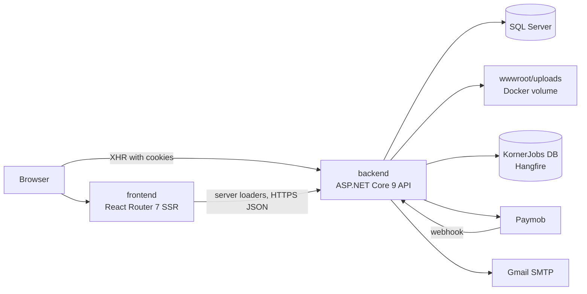
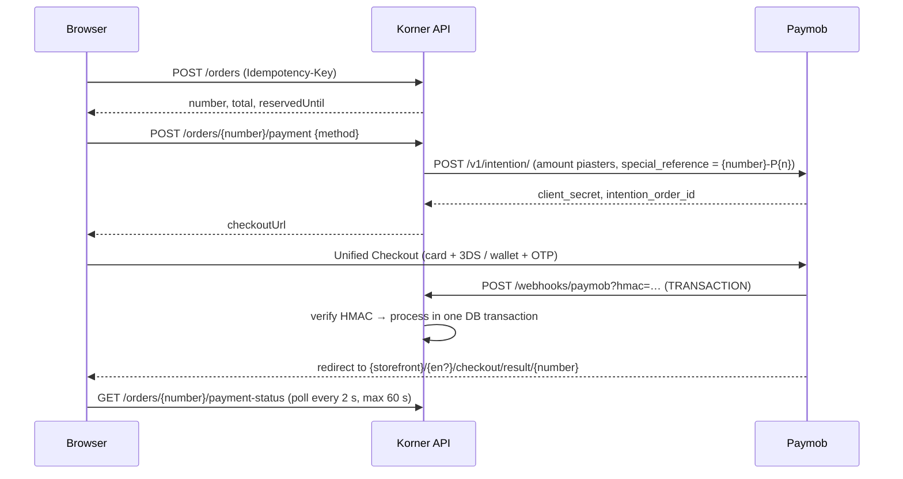

# Korner — Technical Design

> **How** Korner is built. Requirements (IDs like `PAY-02`) are defined in `01-PRODUCT_SPEC.md`.
> When this file and the code disagree, fix the code or open a decision with the owner — never silently diverge.

---

## 1. Architecture



- Storefront on `https://{DOMAIN}` (e.g. `korner.com`), API on `https://api.{DOMAIN}`. Same site → `SameSite=Lax` cookies work between them. CORS allows only the storefront origin(s).
- Public pages are server-rendered by the frontend server, which calls the API **anonymously** (no user tokens on the frontend server). Cart, checkout, account and admin run in the browser and call the API directly with cookies / bearer token.

### 1.1 Repository layout (monorepo)

```
Korner/
├── CLAUDE.md                     # rules for Claude Code
├── README.md                     # how to run
├── docs/                         # these specs + docs/adr/*.md + docs/PROGRESS.md
├── docker-compose.yml            # sqlserver + api + web (dev)
├── .env.example                  # compose variables (no real secrets)
├── .github/workflows/            # backend.yml, frontend.yml, e2e.yml
├── backend/
│   ├── Korner.sln
│   ├── Directory.Build.props     # net9.0, nullable, warnings as errors, analyzers
│   ├── src/Korner.Api/           # single API project, feature folders (Freeqy style)
│   └── tests/
│       ├── Korner.UnitTests/
│       └── Korner.IntegrationTests/   # WebApplicationFactory + Testcontainers SQL Server
└── frontend/
    ├── package.json              # pnpm
    ├── react-router.config.ts    # ssr: true
    ├── app/                      # see §9
    └── tests/e2e/                # Playwright
```

### 1.2 Technology choices (pin exact versions in lockfiles)

| Area | Choice |
| --- | --- |
| Backend | .NET 9, ASP.NET Core Web API with Controllers |
| ORM / DB | EF Core 9 + SQL Server 2022 (Docker image `mcr.microsoft.com/mssql/server:2022-latest` for dev/tests) |
| Auth | ASP.NET Core Identity + JWT bearer + refresh-token cookie + Google OAuth + TOTP 2FA for admins |
| Validation / mapping | FluentValidation (auto-validation filter) + Mapster |
| HTTP clients | `IHttpClientFactory` typed clients (Paymob) with `Microsoft.Extensions.Http.Resilience` for **idempotent GETs only** |
| Background work | **Hangfire** (`Hangfire.Core`, `Hangfire.AspNetCore`, `Hangfire.SqlServer`, `Hangfire.Dashboard.Basic.Authentication`) with its own database `KornerJobs` (`ConnectionStrings:HangfireConnection`), dashboard at `/jobs` behind basic auth (`HangfireSettings`). Follow the owner's recipe `background-jobs/HangfireGuide.md` in the reference repo (§1.3) |
| Email | MailKit over SMTP using `MailSettings` (Gmail SMTP `smtp.gmail.com:587` STARTTLS with an app password in development/MVP; move to a domain mailbox before launch). HTML templates with placeholders, per language |
| Images | **Stored on the API server** under `wwwroot/uploads/{location}` (owner's `FileHelper` approach, improved in §8): validated, re-encoded to WebP in 3 widths with SixLabors.ImageSharp, served as static files with long cache headers; the folder is a Docker volume included in backups |
| Caching | `HybridCache` (`Microsoft.Extensions.Caching.Hybrid`) for public catalogue reads, invalidated on every write — owner's recipe `caching/HybridCache-Guide.md` |
| Logging / monitoring | Serilog (console JSON) + Sentry (backend & frontend) + uptime monitor on `/health` |
| API docs | Swagger/OpenAPI in Development and Staging only |
| Frontend | React Router 7 (framework mode, SSR) + React 19 + TypeScript strict + Vite |
| Frontend data | Route `loader`s for public SSR pages; TanStack Query v5 for interactive/client pages |
| UI | Tailwind CSS 4 + shadcn/ui (Radix) + Lucide icons (the only icon set) |
| Forms | React Hook Form + Zod |
| i18n | `i18next` + `react-i18next` + `remix-i18next` (server-side language detection by URL) |
| Package manager | pnpm |
| Tests | xUnit + FluentAssertions + Testcontainers; Vitest + Testing Library + MSW; Playwright; Lighthouse CI; axe; k6 |
| CI/CD | GitHub Actions, Docker images pushed to GHCR |

---

### 1.3 Owner's reference repository

`https://github.com/Ahmedsayed732004444/dotnet-recipes` holds the owner's own recipes. When implementing these areas,
clone it (read-only, outside the Korner repo) and follow its patterns, adapting names to Korner:

| Recipe | Use in Korner |
| --- | --- |
| `background-jobs/HangfireGuide.md` | Hangfire setup, separate jobs DB, dashboard basic auth, recurring & fire-and-forget jobs (§4.4) |
| `caching/HybridCache-Guide.md` | `HybridCache` for catalogue/category/home/content reads; cache-key prefix constants; `RemoveAsync` on every write |
| `Rate Limiting/RateLimiting-Guide.md` | `RateLimiters` constants class, IP limiter for anonymous endpoints, user limiter for signed-in actions, sliding window for order/payment endpoints (§3.4) |
| `validation/FluentValidation-Guide.md` | (not written yet) — use FluentValidation as described in §3.2 |

If a recipe conflicts with this design (e.g. security), this design wins; mention the difference in the PR.

---

## 2. Cross-cutting rules

1. **Money:** `long` piasters everywhere (C# `long`, SQL `bigint`, JSON number, TS `number`). Display only through `<Money>` / `Money.Format`. The frontend never computes totals.
2. **Time:** store UTC (`datetime2`), inject `TimeProvider` (never `DateTime.UtcNow` in services), display in `Africa/Cairo`.
3. **IDs:** `int` identity for internal tables, `string` for Identity users. Public order reference = `Order.Number` (`K-YYMMDD-NNNN`, from a SQL `SEQUENCE`). Never expose sequential IDs of other customers' data to customers.
4. **Errors:** services return `Result`/`Result<T>`; controllers map to `Ok(...)` or `ToProblem()`. Every error has a stable `Code` (`Inventory.OutOfStock`) which the frontend translates. Exceptions only for truly unexpected failures (global handler → 500 ProblemDetails + Sentry).
5. **Localisation:** API never returns translated sentences for business errors — only codes. Bilingual data fields are columns (`NameAr`, `NameEn`). Emails use `Order.Locale`.
6. **Secrets:** never in git (the repository is **public**). Dev: `backend/src/Korner.Api/appsettings.Local.json` (git-ignored, loaded only when it exists) and root `.env` for Docker (git-ignored). Prod: environment variables. Options are validated at startup (`ValidateOnStart`). Never print secret values in logs, tests, PRs or chat.
7. **Concurrency:** every money or stock change is a guarded (compare-and-set) SQL update inside a transaction. `rowversion` on `Order` and `ProductVariant`.
8. **Audit:** sensitive admin actions write `AuditLogs` (ACC-R1).
9. **Soft delete:** `Product`, `Category` via `DeletedAt` + global `HasQueryFilter`. Orders, payments, refunds are never deleted.
10. **Permission flags in responses:** every response that a UI shows actions for carries server-computed flags for the current requester, e.g. `isMine`, `canEdit`, `canDelete`, `canPublish` + `publishBlockers[]`, `canCancel`, `canRefund` + `refundableAmountPiasters`, `canRetryPayment`, `canRequestReturn`, `allowedTransitions[]`. The frontend shows/hides buttons **only** from these flags (never from the role alone); the action endpoint still enforces the same rule. Flags are computed by the same policy method the action uses (one source of truth), and a test proves flag = enforcement.
11. **Feature availability:** an external integration whose key/ID is missing or `0` (e.g. `PaymobSettings:MobileIntegrationId = 0`) is **disabled, not broken**: the API reports it (`GET /config/public` → `walletEnabled: false`), the UI hides it, startup logs a warning, and Claude Code must tell the owner in the PR and in `docs/PROGRESS.md` → *Owner actions*.

---

## 3. Backend

### 3.1 Folder structure (`backend/src/Korner.Api`)

```
Abstractions/      Result.cs, Error.cs, ResultExtensions.cs, PaginatedList.cs, RequestFilters.cs
Authentication/    JwtOptions, JwtProvider, refresh-cookie helpers, permission handler/provider
BackgroundJobs/    PeriodicJob base + one file per job
Configurations/    *Options classes bound from appsettings/env
Contracts/<Feature>/  Request/Response records + <Request>Validator next to each request
Controllers/       thin controllers, one per feature (+ Admin/ subfolder)
Entities/          EF entities
Enums/
Errors/            <Feature>Errors static classes
Extensions/        DI registration per feature (AddCatalog, AddPayments, ...), ClaimsPrincipal helpers
Mapping/           Mapster configs
Middleware/        exception handler, origin check, maintenance mode, security headers
Persistence/       ApplicationDbContext (+ partial per feature), EntityConfigurations/, Migrations/, Seed/
Services/<Feature>/   I<Feature>Service + implementation (one responsibility each)
Templates/Emails/{ar,en}/*.html
Program.cs         only calls builder.Services.AddKorner(builder.Configuration) and app.UseKorner()
```

Services (one responsibility each): `CatalogQueryService`, `ProductAdminService`, `CategoryService`,
`InventoryService`, `CartService`, `CheckoutService` (quote + create order), `OrderService` (all status transitions),
`PaymentService`, `PaymentProcessor`, `RefundService`, `ShippingService`, `ReturnService`, `ContentService`,
`ReportService`, `AuthService`, `AccountService`, `EmailSender`, `AuditService`, `SettingsService`.

### 3.2 Result / Error pattern (copy exactly)

```csharp
// Abstractions/Error.cs
public record Error(string Code, string Description, int? StatusCode)
{
    public static readonly Error None = new(string.Empty, string.Empty, null);
}

// Abstractions/Result.cs
public class Result
{
    protected Result(bool isSuccess, Error error)
    {
        if ((isSuccess && error != Error.None) || (!isSuccess && error == Error.None))
            throw new InvalidOperationException();
        IsSuccess = isSuccess;
        Error = error;
    }
    public bool IsSuccess { get; }
    public bool IsFailure => !IsSuccess;
    public Error Error { get; }
    public static Result Success() => new(true, Error.None);
    public static Result Failure(Error error) => new(false, error);
    public static Result<T> Success<T>(T value) => new(value, true, Error.None);
    public static Result<T> Failure<T>(Error error) => new(default!, false, error);
}

public class Result<T> : Result
{
    private readonly T? _value;
    internal Result(T value, bool isSuccess, Error error) : base(isSuccess, error) => _value = value;
    public T Value => IsSuccess ? _value! : throw new InvalidOperationException("Failure result has no value");
}

// Abstractions/ResultExtensions.cs  → RFC 7807 ProblemDetails with a stable code
public static class ResultExtensions
{
    public static ObjectResult ToProblem(this Result result)
    {
        if (result.IsSuccess) throw new InvalidOperationException("Cannot convert success to problem.");
        var status = result.Error.StatusCode ?? StatusCodes.Status400BadRequest;
        var problem = new ProblemDetails { Status = status, Title = result.Error.Description };
        problem.Extensions["code"] = result.Error.Code;
        return new ObjectResult(problem) { StatusCode = status };
    }
}

// Errors/InventoryErrors.cs
public static class InventoryErrors
{
    public static readonly Error OutOfStock =
        new("Inventory.OutOfStock", "Requested quantity is not available", StatusCodes.Status409Conflict);
}
```

Validation failures (FluentValidation) return ProblemDetails `400` with `code = "Validation.Failed"` and
`errors: { field: [ "<ErrorCode>" ] }` where each rule sets `.WithErrorCode("Checkout.PhoneInvalid")` etc.

### 3.3 Controller & service shape

```csharp
[ApiController]
[Route("api/v1/cart")]
[AllowAnonymous]
public class CartController(ICartService cartService) : ControllerBase
{
    [HttpPost("items")]
    public async Task<IActionResult> AddItem([FromBody] AddCartItemRequest request, CancellationToken ct)
    {
        var result = await cartService.AddItemAsync(CartRequester.From(HttpContext), request, ct);
        return result.IsSuccess ? Ok(result.Value) : result.ToProblem();
    }
}
```

Controllers contain no logic beyond building the requester and mapping the result. All queries use

**Permission flags (rule §2.10)** — one policy class per aggregate decides both the flag and the enforcement:

```csharp
// Services/Orders/OrderPolicy.cs
public static class OrderPolicy
{
    public static bool CanCancel(Order o, Requester r) =>
        IsOwner(o, r) && o.Status is OrderStatus.PendingPayment or OrderStatus.Confirmed;
    public static bool IsOwner(Order o, Requester r) =>
        (o.UserId is not null && o.UserId == r.UserId) || GuestToken.Matches(o.GuestTokenHash, r.GuestToken);
}

// used when building the response …
public sealed record OrderResponse(string Number, string Status, long TotalPiasters, /* … */
    bool IsMine, bool CanCancel, bool CanRetryPayment, bool CanRequestReturn);

// … and when executing the action
if (!OrderPolicy.CanCancel(order, requester)) return Result.Failure(OrderErrors.CancelNotAllowed);
```

Admin responses use the same idea (`canEdit`, `canDelete`, `canPublish` + `publishBlockers`, `allowedTransitions`,
`canRefund` + `refundableAmountPiasters`). List endpoints include the flags per item.
`AsNoTracking()` + `ProjectToType<T>()` for reads.

### 3.4 Authentication & security

| Topic | Implementation |
| --- | --- |
| Users | `ApplicationUser : IdentityUser` + `FirstName`, `LastName`, `PreferredLocale`, `IsDisabled`, `DeletionRequestedAt`. Roles: `Admin`, `Customer` (and `Staff` in P2) |
| Access token | JWT, 15 min, claims: `sub`, `email`, `role` (one claim per role), `amr` (includes `mfa` when 2FA used). Signed HS256 with a ≥ 32-byte key from env. Returned in the JSON body only |
| Refresh token | 64 random bytes, stored **hashed** (SHA-256) in `RefreshTokens` with family id, expiry 15 days, revoked-at, replaced-by. Cookie `korner_rt`: `HttpOnly; Secure; SameSite=Lax; Path=/api/v1/auth; Domain=.{DOMAIN}`. Rotated on each `/auth/refresh`; presenting a revoked token revokes the whole family |
| CSRF | Endpoints authenticated by cookie (`/auth/refresh`, `/auth/logout`, all `/cart*`, `/checkout*`, `/orders*` for guests) require header `X-Requested-With: korner` **and** an `Origin`/`Referer` in the allowed list (middleware `OriginCheckMiddleware` for unsafe methods) |
| Google OAuth | `GET /api/v1/auth/google?returnUrl=/en/checkout` → Challenge (`AddGoogle`, callback path `/signin-google`) → on callback: find user by Google login or by verified email (link, ACC-03) or create → set refresh cookie → redirect to `{Storefront}/auth/callback?returnUrl=...` (only relative return URLs accepted). The frontend then calls `/auth/refresh` to get an access token. **No token ever travels in a URL** |
| Email/password | Identity with `RequireConfirmedEmail`, lockout 5 attempts / 15 min, password ≥ 8 chars. Confirmation and reset links point to the storefront |
| Admin 2FA | Identity authenticator (TOTP). Admin sign-in without a verified second factor gets a limited token that can only call `/auth/2fa/*`. Setup page shows QR + recovery codes |
| Guest identity | `cart_token` cookie (32 random bytes, `HttpOnly; Secure; SameSite=Lax; Domain=.{DOMAIN}; Max-Age=30d`), stored hashed on `Carts.TokenHash` and copied to `Orders.GuestTokenHash` at order creation |
| CORS | `WithOrigins(Storefront origins from config).AllowCredentials().WithHeaders("Authorization","Content-Type","Idempotency-Key","X-Requested-With")` |
| Headers | HSTS, `X-Content-Type-Options: nosniff`, `Referrer-Policy: strict-origin-when-cross-origin`, `X-Frame-Options: DENY` on API |
| Rate limits | Policy names in a `RateLimiters` constants class (owner's recipe). `authentication` 5/min per IP (fixed window), `checkout` 10/min per IP (**sliding window**, used on `POST /orders` and `POST /orders/{number}/payment`), `track` 10/min per IP, `webhooks` 300/min per IP, `api` 120/min per IP, `user` 60/min per user id for signed-in mutations. Rejection → `429` with code `RateLimit.Exceeded` |
| Maintenance mode | `Settings.MaintenanceMode = true` → `POST /orders` and `/orders/*/payment` return `503` code `Store.Maintenance`; browsing works |

### 3.5 Data model (EF Core, SQL Server)

All money columns `bigint` (piasters). Enums stored as strings (`HasConversion<string>()`, max length set).

| Entity | Fields (→ constraints) |
| --- | --- |
| `Category` | Id, ParentId?, NameAr, NameEn, SlugAr (unique), SlugEn (unique), SortOrder, IsVisible, DeletedAt |
| `Brand` | Id, Name, Slug (unique) |
| `SizeGuide` | Id, NameAr, NameEn, ContentAr, ContentEn (sanitised HTML table), BrandId?, ProductType? |
| `Product` | Id, CategoryId, BrandId?, Type (`Apparel`/`Shoes`/`Perfume`), Status (`Draft`/`Published`/`Hidden`), NameAr, NameEn, SlugAr (unique), SlugEn (unique), DescriptionAr, DescriptionEn, SearchTextAr, SearchTextEn (normalised, indexed), PerfumeVolumeMl?, PerfumeConcentration?, ScentFamily?, NotesAr?, NotesEn?, SizeGuideId?, MetaTitleAr/En?, MetaDescriptionAr/En?, SoldCount, CreatedAt, PublishedAt?, DeletedAt |
| `ProductImage` | Id, ProductId, Path (relative, e.g. `uploads/products/{guid}` without width suffix), Width, Height, AltAr, AltEn, ColorKey?, SortOrder |
| `ProductVariant` | Id, ProductId, Sku (unique), Size?, ColorKey?, ColorNameAr?, ColorNameEn?, ColorHex?, PricePiasters (> 0), CompareAtPricePiasters?, Stock (≥ 0), FulfillmentType (`InStock`/`Dropship`), LeadTimeDays (≥ 0), IsActive, RowVersion |
| `StockMove` | Id, VariantId, Delta, Reason (`Sale`/`Cancellation`/`Return`/`Adjustment`), OrderId?, Note?, ActorId?, CreatedAt |
| `Cart` | Id, TokenHash (unique, nullable), UserId? (unique when not null), UpdatedAt |
| `CartItem` | Id, CartId, VariantId, Quantity (1–10), UnitPriceAtAddPiasters, AddedAt; unique (CartId, VariantId) |
| `Address` | Id, UserId, FullName, Phone, Governorate, Area, Street, Building, FloorApt?, Landmark?, IsDefault |
| `ShippingRule` | Id, Governorate (unique; one of 27 codes), IsActive, FeePiasters, DeliveryDays |
| `Order` | Id, Number (unique), Status, RequiresReview, ReviewReason?, UserId?, GuestTokenHash?, Email, Phone, FullName, Governorate, Area, Street, Building, FloorApt?, Landmark?, Locale (`ar`/`en`), PaymentMethod (`Card`/`Wallet`), SubtotalPiasters, ShippingPiasters, TotalPiasters, PaidPiasters, RefundedPiasters, ReservedUntil?, PaymentAttemptCount, ExpectedDeliveryDate?, CourierName?, TrackingNumber?, TrackingUrl?, MarketingConsent, CreatedAt, PaidAt?, ShippedAt?, DeliveredAt?, CancelledAt?, CancelReason?, RowVersion. CHECKs: `PaidPiasters >= 0`, `0 <= RefundedPiasters <= PaidPiasters` |
| `OrderItem` | Id, OrderId, VariantId, Sku, NameAr, NameEn, Size?, ColorNameAr?, ColorNameEn?, ImagePath?, UnitPricePiasters, Quantity (> 0), FulfillmentType, LeadTimeDays |
| `OrderEvent` | Id, OrderId, FromStatus?, ToStatus, ActorId?, Note?, CreatedAt |
| `OrderNote` | Id, OrderId, AuthorId, Text, AttachmentPaths (json), CreatedAt |
| `ReturnRequest` | Id, OrderId, Reason, Note?, PhotoPaths (json), Status (`Open`/`Refunded`/`Rejected`), RestockedAt?, CreatedAt, ClosedAt? |
| `PaymentAttempt` | Id, OrderId, AttemptNumber, MerchantReference (unique, `{Number}-P{n}`), Provider, Method, AmountPiasters, IntentionId, ProviderOrderId (unique), ClientSecret?, Status (`Created`/`Pending`/`Succeeded`/`Failed`/`Expired`), CreatedAt, ExpiresAt, LastCheckedAt?, CompletedAt?; unique (OrderId, AttemptNumber) |
| `PaymentTransaction` | Id, OrderId?, PaymentAttemptId?, Provider, ProviderTransactionId, ProviderOrderId, MerchantReference?, AmountPiasters, Currency, Success, Pending, IsRefunded, IsVoided, HasParentTransaction, SourceType?, AppliedToOrder, Source (`Webhook`/`Inquiry`), RawPayload (nvarchar(max)), ReceivedAt, UpdatedAt; **unique (Provider, ProviderTransactionId)** |
| `Refund` | Id, OrderId, ProviderTransactionId, AmountPiasters (> 0), Reason (`AdminRequest`/`CustomerCancellation`/`LatePaymentNoStock`/`DuplicatePayment`/`Return`), Note?, Status (`Requested`/`Processing`/`Succeeded`/`Failed`/`Unknown`), IdempotencyKey (unique), ProviderRefundTransactionId?, ProviderMessage?, RequestedBy?, CreatedAt, CompletedAt? |
| `IdempotencyRecord` | Id, Key, Scope (e.g. `orders:create`), RequestHash, ResponseStatus, ResponseBody, CreatedAt; unique (Scope, Key); purge after 24 h |
| `OutboxMessage` | Id, Type, Payload (json), DeduplicationKey (unique), CreatedAt, ProcessedAt?, Attempts, NextAttemptAt, LastError? |
| `AuditLog` | Id, ActorId, Action, EntityType, EntityId, Before (json), After (json), Ip, CreatedAt |
| `RefreshToken` | Id, UserId, TokenHash (unique), FamilyId, ExpiresAt, CreatedAt, RevokedAt?, ReplacedByHash? |
| `Banner` | Id, ImagePathAr, ImagePathEn, TitleAr, TitleEn, LinkUrl, SortOrder, IsActive |
| `ContentPage` | Id, Key (`terms`/`privacy`/`shipping`/`returns`/`about`/`faq`, unique), TitleAr, TitleEn, BodyAr, BodyEn (sanitised HTML), UpdatedAt |
| `Setting` | Key (PK), Value — keys: `FreeShippingThresholdPiasters`, `LowStockThreshold`, `MaintenanceMode`, `ReviewThresholdPiasters` (default 1,000,000 = 10,000 EGP), `AdminAlertEmail`, `WhatsAppNumber` |

**Indexes:** Variant.Sku; Product.SlugAr/SlugEn; Product(Status, CategoryId); Product.SearchTextAr/En;
Order.Number; Order.Phone; Order.Email; Order(Status, CreatedAt); Order(Status, ReservedUntil);
PaymentAttempt(Status, CreatedAt); OutboxMessage(ProcessedAt) filtered `ProcessedAt IS NULL`.

**Seed (Development/Staging only):** 27 governorates shipping rules, admin user (from env), 3 categories, 10 sample
products with variants, content pages with placeholder text.

The 27 governorate codes: `CAI` Cairo, `GIZ` Giza, `ALX` Alexandria, `QAL` Qalyubia, `SHR` Sharqia, `DK` Dakahlia,
`GH` Gharbia, `MNF` Monufia, `BH` Beheira, `KFS` Kafr El Sheikh, `DT` Damietta, `PTS` Port Said, `IS` Ismailia,
`SUZ` Suez, `FYM` Faiyum, `BNS` Beni Suef, `MN` Minya, `AST` Asyut, `SHG` Sohag, `KN` Qena, `LX` Luxor, `ASN` Aswan,
`BA` Red Sea, `WAD` New Valley, `MT` Matrouh, `SIN` North Sinai, `JS` South Sinai. Names in both languages live in a
static list (backend `Governorates.cs` + frontend `governorates.ts`, generated from one JSON file in `docs/data/governorates.json`).

### 3.6 Checkout, pricing and inventory

**Quote (`POST /api/v1/checkout/quote`, body `{ governorate }`)** — loads the cart, current variant prices and stock,
shipping rule and settings, and returns lines, `subtotal`, `shipping` (0 when subtotal ≥ threshold), `total`,
`expectedDeliveryDate`, and a `changes[]` list (price changed / out of stock / quantity reduced) for CART-05.

**Create order (`POST /api/v1/orders`, header `Idempotency-Key: <uuid>`)**:

1. Idempotency filter: same key + same request hash → return the stored response; same key + different body → `409 Idempotency.Mismatch`.
2. Validate body (CHK-02/03/07). Maintenance mode check. Governorate rule active.
3. Recompute the quote. If `changes[]` is not empty → `409 Checkout.CartChanged` with the fresh quote (frontend shows it, customer re-confirms).
4. Begin transaction. For each `InStock` line (grouped by variant, ordered by variant id): `UPDATE ProductVariants SET Stock = Stock - @q WHERE Id = @id AND Stock >= @q` via `ExecuteUpdateAsync`; 0 rows → rollback, `409 Inventory.OutOfStock` with the variant id.
5. Insert `Order` (`PendingPayment`, `ReservedUntil = now + 15 min`, `GuestTokenHash` or `UserId`, snapshot items), `StockMove`s, `OrderEvent`; flag `RequiresReview` if total ≥ review threshold and the email/phone has no previous paid order. Clear the cart. Commit.
6. Return `{ number, total, reservedUntil }`. The frontend immediately calls `POST /orders/{number}/payment`.

Order number: `K-{yyMMdd}-{NNNN}` where `NNNN` = next value of SQL sequence `OrderNumbers` modulo 10000, zero-padded; unique index guarantees safety.

### 3.7 Order state transitions

All transitions go through `OrderService.TryTransitionAsync(orderId, from, to, actor, note)`:
a compare-and-set `UPDATE ... WHERE Id = @id AND Status = @from` + an `OrderEvent` row, inside the caller's
transaction. The allowed map is exactly the diagram in the product spec §8.1; anything else throws (programming error).
Side effects per transition:

| Transition | Side effects |
| --- | --- |
| PendingPayment → Confirmed | `ExpectedDeliveryDate` set (SHP-02), `ReservedUntil = null`, Outbox `OrderPaid` |
| PendingPayment → Cancelled | release stock, attempts `Expired`, no email if never paid |
| Confirmed → Cancelled | release stock, queue full refund (`RefundService.QueueFullRefundAsync`), Outbox `OrderCancelled` |
| Cancelled → Confirmed | only from `PaymentProcessor` late-payment path after re-reserving stock |
| Confirmed → Processing | blocked while `RequiresReview` |
| Processing → Shipped | requires tracking number; Outbox `OrderShipped` |
| Shipped → Delivered | `DeliveredAt` |
| Shipped → ReturnedToOrigin | admin decides refund amount via refund dialog; restock after inspection |
| Delivered → ReturnRequested | must be ≤ 14 days after `DeliveredAt`; creates `ReturnRequest` |
| ReturnRequested → ReturnClosed | after refund succeeded or rejection note |

---

## 4. Payments — Paymob integration (online only)

### 4.1 Settings (`PaymobSettings`, values in `appsettings.Local.json`)

| Key | Meaning | Used by Korner |
| --- | --- | --- |
| `SecretKey` (`egy_sk_test_…` / `egy_sk_live_…`) | Intention + refund auth (`Authorization: Token …`) | Yes |
| `PublicKey` (`egy_pk_test_…`) | Builds the Unified Checkout URL (safe for browser) | Yes |
| `APIKey` | Legacy auth token for the inquiry API only | Yes |
| `HMAC` | HMAC secret for webhook verification | Yes |
| `CardIntegrationId` | Online card integration | Yes (required) |
| `MobileIntegrationId` | Mobile wallet integration. **`0` = wallets disabled** → hide the wallet option and report to the owner (rule §2.11) | Yes, optional |
| `IframeId`, `AuthCaptureIntegrationId` | Legacy iframe / auth-capture flow | **No** — keep the keys, ignore them |
| `BaseUrl` (`https://accept.paymob.com/api/`) | Owner's existing value | The client uses only its scheme + host (`https://accept.paymob.com/`) as root, because the intention endpoint is `/v1/intention/` (outside `/api`) |
| `ApiPublicUrl`, `StorefrontUrl` | Public HTTPS bases for `notification_url` / `redirection_url` (dev: tunnel URL) | Yes |
| `InquiryPath` | Default `api/ecommerce/orders/transaction_inquiry` — **confirm in the dashboard API explorer** | Yes |
| `ReservationMinutes` = 15, `MaxAttemptsPerOrder` = 5 | Business settings | Yes |

`PayoutSettings` (Paymob payouts) exists in the owner's secrets but payouts are **out of scope** — do not implement anything with it.
Test and live keys use the same host; the secret key and integration IDs must be the same mode or Paymob returns 404.
Validate with DataAnnotations + `ValidateOnStart`.

### 4.2 Endpoints used

| Operation | Request | Auth |
| --- | --- | --- |
| Create intention | `POST /v1/intention/` | `Authorization: Token {SecretKey}` |
| Hosted page | redirect to `/unifiedcheckout/?publicKey={PublicKey}&clientSecret={client_secret}` | — |
| Refund | `POST /api/acceptance/void_refund/refund` body `{ transaction_id, amount_cents }` | `Authorization: Token {SecretKey}` |
| Inquiry auth token | `POST /api/auth/tokens` body `{ api_key }` → `{ token }` (cache 45 min) | — |
| Inquiry by Paymob order id | `POST {InquiryPath}` body `{ auth_token, order_id }` | `Authorization: Bearer {token}` |

### 4.3 Payment flow



**Start payment (`POST /api/v1/orders/{number}/payment`, body `{ method: "card" | "wallet" }`)**

1. Load order; requester must own it (JWT user id, or `cart_token` hash = `GuestTokenHash`); otherwise `404`. Method `wallet` while `MobileIntegrationId = 0` → `400 Payment.MethodDisabled`.
2. Order must be `PendingPayment`, `PaidPiasters == 0`, `ReservedUntil > now` → else `409 Payment.NotAwaitingPayment` / `Payment.ReservationExpired`.
3. If an attempt with the same method is `Created`, has a client secret and ≥ 3 min left → return its URL (double-click safe).
4. If `PaymentAttemptCount >= 5` → `429 Payment.TooManyAttempts`.
5. Atomically claim the next attempt: `UPDATE Orders SET PaymentAttemptCount = n+1, ReservedUntil = now+15m, PaymentMethod = @m WHERE Id=@id AND Status='PendingPayment' AND PaymentAttemptCount = n AND ReservedUntil > now`.
6. Create intention with: `amount` = `TotalPiasters`; `currency` `EGP`; `payment_methods` = `[integrationId of method]`; `items` = one line `Order {number}` with the full total (Paymob rejects items that don't sum to the amount); `billing_data` from the order (empty values → `"NA"`, `phone_number` required, `country` `EGY`); `special_reference` = `{number}-P{n}`; `expiration` = 900; `notification_url` = `{ApiPublicUrl}/api/v1/webhooks/paymob`; `redirection_url` = `{StorefrontUrl}{/en if en}/checkout/result/{number}`.
7. Save `PaymentAttempt` (`Created`) and return `{ checkoutUrl, expiresAt }`.

**Webhook (`POST /api/v1/webhooks/paymob?hmac=…`)** — `[AllowAnonymous]`, rate limit `webhooks`, body ≤ 64 KB, excluded from Origin check.

1. Parse JSON; require `obj` object. If `type != "TRANSACTION"` → `200` and ignore.
2. **HMAC:** concatenate, with no separator, these `obj` values in this order:
   `amount_cents, created_at, currency, error_occured, has_parent_transaction, id, integration_id, is_3d_secure, is_auth, is_capture, is_refunded, is_standalone_payment, is_voided, order.id, owner, pending, source_data.pan, source_data.sub_type, source_data.type, success`.
   Values exactly as in the JSON (booleans `true`/`false` lowercase, numbers as raw text, strings unquoted, null/missing → empty).
   `HMACSHA512(key = PaymobSettings:HMAC)`, lowercase hex, compare with `CryptographicOperations.FixedTimeEquals`. Mismatch → `401`.
   Unit test: Paymob's documented sample must produce
   `1002020-03-25T18:39:44.719228EGPfalsefalse25567066741truefalsefalsefalsetruefalse47782394705false2346MasterCardcardtrue`.
3. Call `PaymentProcessor.ProcessAsync(transaction, "Webhook")`. Return `200` after commit; unhandled error → `500` (Paymob retries; processing is idempotent).

**`PaymentProcessor.ProcessAsync` (shared by webhook, status polling and jobs) — one DB transaction:**

1. Upsert `PaymentTransaction` by `(Provider, ProviderTransactionId)`: unchanged state → return `Duplicate`; changed (pending → final, or refunded/voided flags) → update; unique-violation on insert → `Duplicate`.
2. `has_parent_transaction == true` (refund/void child) → store only.
3. Match `PaymentAttempt` by `order.merchant_order_id` (= `special_reference`) or `ProviderOrderId`. None → admin alert, store, return.
4. `pending` → attempt `Pending`. `!success` → attempt `Failed` (order stays `PendingPayment`, customer may retry).
5. Success: claim once with `UPDATE PaymentTransactions SET AppliedToOrder = 1 WHERE Id=@id AND AppliedToOrder = 0` (0 rows → return). Attempt `Succeeded`, clear `ClientSecret`. `UPDATE Orders SET PaidPiasters += amount, PaidAt = ISNULL(PaidAt, now)`.
6. Amount ≠ attempt amount ≠ order total, or currency ≠ EGP → flag `RequiresReview`, admin alert, stop (PAY-03).
7. By order status: `PendingPayment` → `Confirmed` (+ Outbox `OrderPaid`); `Cancelled` → savepoint, re-reserve stock, `Cancelled → Confirmed` if possible, otherwise rollback to savepoint + queue full refund (`LatePaymentNoStock`) + Outbox `LatePaymentRefunded` (PAY-08); already `Confirmed` or later → queue refund `DuplicatePayment` + admin alert.
8. Queued refunds reserve the amount first: `UPDATE Orders SET RefundedPiasters += a WHERE Id=@id AND RefundedPiasters + a <= PaidPiasters`.

**Payment status (`GET /api/v1/orders/{number}/payment-status`)** → `{ state: paid|pending|failed|cancelled|review, canRetry, payBefore, total }`.
If the newest attempt is `Created`/`Pending`, older than 15 s, and not checked in the last 20 s → mark `LastCheckedAt`, inquire Paymob, process the result, then answer.

### 4.4 Background jobs (Hangfire)

Registered as **recurring jobs** at startup with `RecurringJob.AddOrUpdate` (stable ids = class names), each decorated with
`[DisableConcurrentExecution(timeoutInSeconds: 300)]` (no overlapping runs, safe with several API instances) and
`[AutomaticRetry(Attempts = 0)]` (they run again on the next tick; all of them are idempotent). One-off work
(e.g. send an email right after commit) uses `BackgroundJob.Enqueue` **after** the DB transaction commits; the Outbox table
remains the source of truth so nothing is lost if Hangfire is down. Dashboard `/jobs` protected with
`HangfireCustomBasicAuthenticationFilter` (`HangfireSettings`) and, in production, reachable only from the admin IP / VPN.

| Job | Interval | Behaviour |
| --- | --- | --- |
| `PaymentExpiryJob` | 1 min | Orders `PendingPayment`, `ReservedUntil < now`, `PaidPiasters = 0` (max 50): inquire every open attempt first. If paid → processed. If Paymob unreachable or a transaction is pending → wait (max 60 min after deadline). Else transition to `Cancelled`, release stock, mark attempts `Expired`, clear client secrets |
| `PaymentReconciliationJob` | 15 min | Attempts from the last 48 h with status `Created`/`Pending`/`Expired` not checked in the last 10 min (max 200): inquire and process (catches late payments with lost webhooks) |
| `RefundDispatchJob` | 1 min | Refunds `Requested` → claim (`Requested → Processing` compare-and-set) → call Paymob → finalise |
| `OutboxJob` | every minute + enqueued right after each commit that adds a message | Send up to 50 unsent messages; exponential backoff (1 min → 6 h), alert after 10 failures |
| `ShippingAlertJob` | 1 h | SHP-03 alerts; open returns > 5 days (RET-03) |
| `LowStockJob` | daily | Variants with stock ≤ threshold → one admin email |
| `CleanupJob` | daily | Expired idempotency records, revoked refresh tokens > 30 days, empty guest carts > 30 days, anonymise accounts with deletion requested > 30 days (ACC-06) |

### 4.5 Refunds

- `RefundService.CreateAsync(orderId, amount, note, idempotencyKey, adminId)` (admin, `Idempotency-Key` header required): reuse by key; choose the newest applied successful transaction with enough remaining (`amount - non-failed refunds`); reserve on the order (guarded update); insert `Refund` `Processing`; commit; call Paymob **outside** the DB transaction; finalise.
- Finalise: `Succeeded` → `OrderEvent` + Outbox `PaymentRefunded`; `Failed` (4xx or `success:false`) → release reservation; `Unknown` (timeout, 5xx, `pending`) → keep reservation, admin alert, **never retry automatically**. `POST /admin/refunds/{id}/resolve { succeeded, note }` closes an `Unknown` refund after the admin checks the Paymob dashboard.

### 4.6 Local testing of Paymob

Test keys + Paymob test cards/wallet (from Paymob docs). Webhooks need a public HTTPS URL → run `cloudflared tunnel --url http://localhost:5080` (or ngrok) and set `Paymob__ApiPublicUrl`. `https://hooks.paymob.com` can be used to inspect raw callbacks.

---

## 5. Emails (Outbox)

Types: `OrderPaid`, `OrderShipped`, `OrderCancelled`, `PaymentRefunded`, `LatePaymentRefunded`, `EmailConfirmation`,
`PasswordReset`, `AdminAlert`. Payload is JSON with everything needed to render (no DB lookups in the sender except
the order summary). Templates: `Templates/Emails/{ar|en}/{Type}.html`, RTL `dir="rtl"` for Arabic, inline CSS, brand
colour `#0077BC` for buttons. Links go to the storefront. `DeduplicationKey` examples: `paid:{number}`,
`shipped:{number}`, `refund:{refundId}`, `alert:{kind}:{id}`.

---

## 6. API contract (all under `/api/v1`)

Responses are JSON (camelCase). Errors are ProblemDetails with `code`. Money fields end with `Piasters`.
Public endpoints accept `?lang=ar|en` only where a localised slug lookup is needed.

| Method & path | Purpose | Auth / policy | Req |
| --- | --- | --- | --- |
| `GET /categories` | Category tree | public, cached 60 s | CAT-01 |
| `GET /products?category=&q=&size=&color=&brand=&minPrice=&maxPrice=&inStock=&sort=&page=&pageSize=` | Listing (pageSize ≤ 48) | public, `api` | CAT-10, CAT-11 |
| `GET /products/{slug}?lang=` | Product detail incl. variants, images, size guide, delivery estimate | public | CAT-02..08 |
| `GET /content/home` · `GET /content/pages/{key}` | Banners, sections; policy pages | public | ADM-07 |
| `GET /shipping/governorates` | Active governorates with fee & days | public | SHP-01 |
| `GET /cart` · `POST /cart/items` · `PATCH /cart/items/{id}` · `DELETE /cart/items/{id}` | Cart | cart cookie or JWT | CART-01..05 |
| `POST /checkout/quote` | Server totals + changes | cart cookie or JWT | CHK-04, CHK-05 |
| `POST /orders` | Create order, reserve stock | `Idempotency-Key`, `checkout` | CHK-08 |
| `POST /orders/{number}/payment` | Start / retry payment → `checkoutUrl` | owner, `checkout` | PAY-01, CHK-09 |
| `GET /orders/{number}/payment-status` | Result-page polling | owner | PAY-06 |
| `POST /orders/{number}/cancel` | Customer cancel | owner | ORD-05 |
| `GET /orders/track?number=&phone=` | Guest tracking (status, dates, tracking link; no address) | public, `track` | ORD-07 |
| `GET /orders/{number}/invoice.pdf` | Invoice | owner or Admin | PAY-11 |
| `POST /webhooks/paymob` | Paymob callback | HMAC, `webhooks` | PAY-02..05, 08 |
| `POST /auth/register` · `POST /auth/login` · `POST /auth/refresh` · `POST /auth/logout` · `POST /auth/confirm-email` · `POST /auth/forgot-password` · `POST /auth/reset-password` · `GET /auth/google` · `POST /auth/2fa/*` | Auth | `authentication` | ACC-01..03, ACC-R2 |
| `GET /me` · `PATCH /me` · `GET /me/orders` · `GET /me/orders/{number}` · `GET/POST/PUT/DELETE /me/addresses` · `DELETE /me` | Account | JWT | ACC-04..06 |
| `GET/POST/PUT/DELETE /admin/products` · `POST /admin/products/{id}/publish` · `/admin/products/{id}/variants` · `POST/DELETE /admin/products/{id}/images` (multipart) | Catalogue admin | Admin | ADM-01 |
| `/admin/categories` · `/admin/brands` · `/admin/size-guides` | | Admin | ADM-02 |
| `GET /admin/inventory` · `POST /admin/inventory/adjustments` · `GET /admin/inventory/{variantId}/moves` | Inventory | Admin | ADM-03 |
| `GET /admin/orders?status=&q=&review=` · `GET /admin/orders/{id}` · `POST /admin/orders/{id}/transition` · `POST /admin/orders/{id}/notes` · `POST /admin/orders/{id}/clear-review` · `PATCH /admin/orders/{id}` (address/size edits before shipping) | Orders | Admin | ADM-04, ORD-06 |
| `POST /admin/orders/{id}/refunds` · `POST /admin/refunds/{id}/resolve` | Refunds | Admin + `Idempotency-Key` | PAY-09 |
| `POST /admin/orders/{id}/returns` · `POST /admin/returns/{id}/restock` · `POST /admin/returns/{id}/close` | Returns | Admin | RET-02..05 |
| `GET/PUT /admin/shipping-rules` · `GET/PUT /admin/settings` · `/admin/banners` · `/admin/pages` | Settings & content | Admin | ADM-06, ADM-07, ADM-09 |
| `GET /admin/reports/daily?date=` | Daily report | Admin | ADM-08 |
| `GET /config/public` | Feature availability for the UI: `walletEnabled`, `cardEnabled`, `maintenanceMode`, `freeShippingThresholdPiasters`, `whatsAppNumber` | public, cached 60 s | §2.11 |
| `GET /health` | DB + outbox lag | public (no details in prod) | NFR |

The backend publishes the OpenAPI document; the frontend generates TypeScript types from it
(`pnpm gen:api` using `openapi-typescript`) — never hand-write DTO types that the API owns.

**Error codes (initial list; add as needed, keep `ar.json`/`en.json` in sync):**
`Validation.Failed`, `Auth.InvalidCredentials`, `Auth.EmailNotConfirmed`, `Auth.LockedOut`, `Auth.TwoFactorRequired`,
`Catalog.ProductNotFound`, `Catalog.PublishIncomplete`, `Cart.ItemNotFound`, `Cart.QuantityLimit`,
`Inventory.OutOfStock`, `Checkout.CartEmpty`, `Checkout.CartChanged`, `Checkout.GovernorateUnavailable`,
`Checkout.PhoneInvalid`, `Idempotency.Mismatch`, `Order.NotFound`, `Order.TransitionNotAllowed`,
`Order.RequiresReview`, `Order.CancelNotAllowed`, `Payment.NotAwaitingPayment`, `Payment.ReservationExpired`,
`Payment.TooManyAttempts`, `Payment.GatewayUnavailable`, `Payment.GatewayRejected`, `Payment.RefundExceedsPaid`,
`Payment.NoRefundableTransaction`, `Payment.RefundFailed`, `Payment.MethodDisabled`, `File.InvalidImage`, `File.TooLarge`, `Store.Maintenance`, `RateLimit.Exceeded`.

---

## 7. Search normalisation (CAT-10)

`TextNormalizer.Normalize(string)`: lower-case; Arabic: remove diacritics (U+064B–U+065F, U+0670) and tatweel (U+0640),
`أ إ آ ٱ → ا`, `ة → ه`, `ى → ي`, `ؤ → و`, `ئ → ي`; remove spaces and hyphens for a compact form too.
`Product.SearchTextAr/En` = normalised name + brand + category, saved on every product save.
Query: normalise the input; match `LIKE %term%` on either column or on the compact form. Keep behind
`ISearchService` so Meilisearch (P2) replaces it without touching controllers.

---

## 8. Images (stored on the API server)

Based on the owner's `FileHelper.UploadeFileAsync` / `DeleteFile` pattern (save under `wwwroot/{location}` with a GUID file name), with these improvements — implement as `IFileStorage` + `LocalFileStorage` so it can move to object storage later without touching services:

| Topic | Rule |
| --- | --- |
| Upload | `multipart/form-data` to admin endpoints (`POST /admin/products/{id}/images`, `/admin/banners`, order notes, returns). Max 5 MB per file, max 10 files per request (`[RequestSizeLimit]`) |
| Validation | Extension in `.jpg .jpeg .png .webp` **and** magic bytes checked (never trust `ContentType`); decode with ImageSharp (invalid image → `400 File.InvalidImage`); max 6000×6000 px |
| Processing | Auto-orient, strip EXIF/GPS metadata, re-encode to WebP (quality 80) in widths **480, 960, 1440** (never upscale) → files `{guid}_480.webp`, `{guid}_960.webp`, `{guid}_1440.webp` in `wwwroot/uploads/{location}/` (`location` = `products`, `banners`, `orders`, `returns`) |
| What is stored in DB | The **relative path without width**: `uploads/products/{guid}` + original width/height. Never store an absolute URL (the owner's helper built it from `Request.Host`, which breaks behind a reverse proxy and when the domain changes) |
| URLs in responses | `FileUrlBuilder` builds absolute URLs from `Storage:PublicBaseUrl` (e.g. `https://api.korner.com`) and returns `{ url, srcSet, width, height }` — `url` = 960 variant, `srcSet` = all 3 widths |
| Serving | `UseStaticFiles` with `Cache-Control: public, max-age=31536000, immutable` for `/uploads` (names are unique GUIDs, files never change) |
| Deleting | Remove the DB row first, commit, then delete all width variants (`DeleteFile` equivalent). Deletion failures are logged, never thrown |
| Persistence | `wwwroot/uploads` is a named Docker volume (`korner_uploads`) and is part of the daily backup (together with the DB) |
| Library licence | SixLabors.ImageSharp (Six Labors Split License: free for companies under USD 1M annual revenue — note it in an ADR) |

## 9. Frontend (`frontend/`)

### 9.1 Structure

```
app/
  root.tsx              # <html lang dir>, fonts, providers, global ErrorBoundary
  entry.server.tsx      # CSP nonce, security headers, i18n instance per request
  routes.ts             # all routes; public routes registered twice: "" (ar) and "en" prefix
  routes/
    shop/      home.tsx category.tsx product.tsx search.tsx page.tsx
    checkout/  cart.tsx checkout.tsx result.tsx track.tsx
    auth/      sign-in.tsx register.tsx callback.tsx forgot.tsx reset.tsx confirm.tsx
    account/   orders.tsx order.tsx addresses.tsx settings.tsx
    admin/     layout.tsx dashboard.tsx products.tsx product-edit.tsx categories.tsx inventory.tsx
               orders.tsx order.tsx shipping.tsx content.tsx settings.tsx two-factor.tsx
    seo/       sitemap[.]xml.ts robots[.]txt.ts
  features/<catalog|cart|checkout|orders|account|auth|admin>/
    api/ hooks/ components/ types/ schemas/ index.ts   # only index.ts is importable from outside
  shared/
    ui/          # shadcn components (generated)
    components/  # Money, EmptyState, ConfirmDialog, LanguageSwitcher, ResponsiveImage, PageHeader
    hooks/ types/
  lib/
    api/         # client.ts (fetch wrapper), errors.ts, queryClient.ts, generated schema types
    i18n/        # i18n.server.ts, i18n.client.ts, locales/ar/*.json, locales/en/*.json
    env.server.ts env.client.ts  # Zod-validated, app fails to start if invalid
    analytics.ts logger.ts format.ts governorates.ts
  app.css        # theme tokens (see design system)
```

Layer rule: `routes → features → shared → lib` only. A feature may import another feature only through its `index.ts`.
Enforced by ESLint `import/no-restricted-paths`. `no-console` is an error (use `lib/logger.ts`).

### 9.2 Routing & language

- Arabic routes at `/…`, English at `/en/…`; locale comes from the path (never from a cookie for public pages). `<html lang="ar" dir="rtl">` or `lang="en" dir="ltr"`.
- Every public page sets `<link rel="alternate" hreflang="ar|en|x-default">` and a canonical URL. Slugs differ per language; the product API returns both slugs so the language switcher links to the same product.
- Public pages (home, category, product, search, content pages) are SSR with `loader` + `meta`; cart, checkout, result, track, account and admin are client-rendered (`clientLoader` / TanStack Query) and `noindex`.

### 9.3 API client & session

- `lib/api/client.ts`: `fetch` wrapper with `credentials: "include"`, `X-Requested-With: korner`, JSON, `Authorization: Bearer` from an in-memory token store. On `401` → single-flight `POST /auth/refresh` (queue concurrent requests) → retry once → on failure clear session.
- On app start (client), call `/auth/refresh` silently to restore the session.
- Server loaders call the API with `API_INTERNAL_URL` and no user credentials.
- TanStack Query: `retry` = 0 for 4xx, 2 for network/5xx on GETs; **never retry mutations** (orders, payments, refunds).
- Query key factories per feature: `productKeys`, `cartKeys`, `orderKeys`, `adminOrderKeys`, …
- `lib/api/errors.ts`: `getErrorCode(err)` → translation key `errors:<Code>`; map `Validation.Failed` field errors into React Hook Form `setError`.

### 9.4 Checkout & payment UX

1. Checkout page loads quote; governorate change re-quotes. Zod schema mirrors backend validation (phone regex `^01[0125][0-9]{8}$`).
2. "Pay {total}" → generates one `Idempotency-Key` (uuid) per checkout attempt, kept in `sessionStorage` until success → `POST /orders` → `POST /orders/{number}/payment` → `window.location.assign(checkoutUrl)`.
3. `409 Checkout.CartChanged` → show changes dialog with the new quote; `409 Inventory.OutOfStock` → mark the line and return to cart.
4. `/checkout/result/:number`: poll payment-status every 2 s up to 60 s: `paid` → success view (CHK-10) + fire `purchase` analytics once (guard by order number in `sessionStorage`); `failed` → retry buttons (card / wallet) reusing the same order; `pending` after 60 s → "We're confirming your payment, we'll email you"; `cancelled` → explain and link to cart.

### 9.5 Other frontend rules

- Money: `formatMoney(piasters, locale)` with `Intl.NumberFormat(locale === "ar" ? "ar-EG" : "en-EG", { style: "currency", currency: "EGP" })`.
- Forms: RHF + Zod, labels above inputs, errors below with `aria-describedby`, focus first invalid field.
- Images: `ResponsiveImage` with width/height, `srcset`, `loading="lazy"` except the LCP image (`fetchpriority="high"`).
- CSP: nonce-based script policy; images from the API origin only; Paymob redirect; GA/Meta only when enabled.
- Analytics (`lib/analytics.ts` only): `view_item`, `add_to_cart`, `begin_checkout`, `purchase`; disabled unless env ids are set.
- Admin: route guard (`/admin/*` requires role `Admin` and `amr` contains `mfa`), dense tables that become cards on mobile.

---

## 10. Quality, environments, delivery

### 10.1 Test strategy

| Level | Tool | Must cover |
| --- | --- | --- |
| Backend unit | xUnit + FluentAssertions | quote math (subtotal, free shipping, delivery date), `TextNormalizer`, order transition map, HMAC (Paymob sample string), Paymob client request/response mapping with a fake `HttpMessageHandler`, refund outcome mapping |
| Backend integration | `WebApplicationFactory` + Testcontainers SQL Server | 20 concurrent orders on the last unit → exactly 1 succeeds; idempotent `POST /orders`; webhook duplicate & concurrent; amount mismatch; late payment (stock / no stock); double payment; expiry job with inquiry stub; refund guard never exceeds paid; auth refresh rotation & reuse detection; role checks |
| Frontend unit/component | Vitest + Testing Library + MSW | `formatMoney`, error-code mapping, Zod schemas, size selector, cart drawer, checkout form states (loading, error, success, empty) |
| E2E | Playwright (mobile + desktop, ar + en) | browse → cart → checkout → Paymob **stubbed** redirect → result page (paid via simulated webhook); payment failure → retry; out-of-stock during checkout; guest tracking; admin ships an order |
| Quality gates | Lighthouse CI + axe | NFR targets; zero serious/critical axe violations |
| Load | k6 (manual before launch & campaigns) | 200 concurrent catalogue users, 20 checkouts/min, 0 errors |

Paymob in automated tests: a `FakePaymentProvider` (DI switch `Payments:Provider=Fake` in Test env) whose hosted page
is a local route that posts a correctly signed webhook. Real Paymob sandbox is exercised manually in milestone M4.

### 10.2 Environments

| Env | Purpose | Paymob | Data |
| --- | --- | --- | --- |
| Development | `docker compose up` (SQL Server) + `dotnet watch` + `pnpm dev` | Test keys (or Fake) | Seed |
| Staging | Mirror of production | Test keys | Seed, no real customers |
| Production | Live store | Live keys | Real |

### 10.3 Configuration (`.env.example` files, no real values)

Backend configuration sections (names match the owner's existing projects). Real development values are in
`backend/src/Korner.Api/appsettings.Local.json` (git-ignored, provided by the owner — see `docs/SECRETS.md`):
`ConnectionStrings:DefaultConnection`, `ConnectionStrings:HangfireConnection`, `Jwt` (`Key`, `Issuer`, `Audience`, `AccessTokenMinutes`, `RefreshTokenDays`),
`Auth` (`CookieDomain`, `StorefrontOrigins[]`), `Authentication:Google` (`ClientId`, `ClientSecret`, `RedirectUri` = callback path `/signin-google`, `Scopes`),
`MailSettings` (`Mail`, `DisplayName`, `Password`, `Host`, `Port`), `PaymobSettings` (see §4.1), `HangfireSettings` (`Username`, `Password`),
`Storage` (`PublicBaseUrl`), `Seed` (`AdminEmail`, `AdminPassword`), `Sentry` (`Dsn`).
In production the same keys come from environment variables (`PaymobSettings__SecretKey`, …).
Frontend: `API_INTERNAL_URL` (server), `PUBLIC_API_URL`, `PUBLIC_SITE_URL`, `PUBLIC_SENTRY_DSN`, `PUBLIC_GA_ID`, `PUBLIC_META_PIXEL_ID`.

### 10.4 CI/CD (GitHub Actions)

- `backend.yml`: restore → build (warnings as errors) → unit tests → integration tests (Testcontainers) → `dotnet list package --vulnerable` → Docker build (on `main`).
- `frontend.yml`: install (pnpm, frozen lockfile) → lint → typecheck → unit tests → build → Lighthouse CI + axe against a preview → `pnpm audit --prod`.
- `e2e.yml`: compose up (API with Fake payments + SQL Server + web) → Playwright → upload report.
- Branching: `main` protected; feature branches `feat/<milestone>-<short>`; Conventional Commits; PR must pass all checks.
- Deploy (milestone M7): images to GHCR → staging (auto on `main`) → production (manual approval). Migrations run as a separate step before the new API starts and must be backward compatible. Rollback = redeploy previous image tag.

### 10.5 Observability

Serilog request logging (method, path, status, duration, correlation id; never bodies, tokens, phones or addresses),
Sentry for exceptions in both apps, `/health` (DB connectivity + outbox oldest unsent age < 10 min), uptime monitor,
daily DB backup + monthly restore test.
